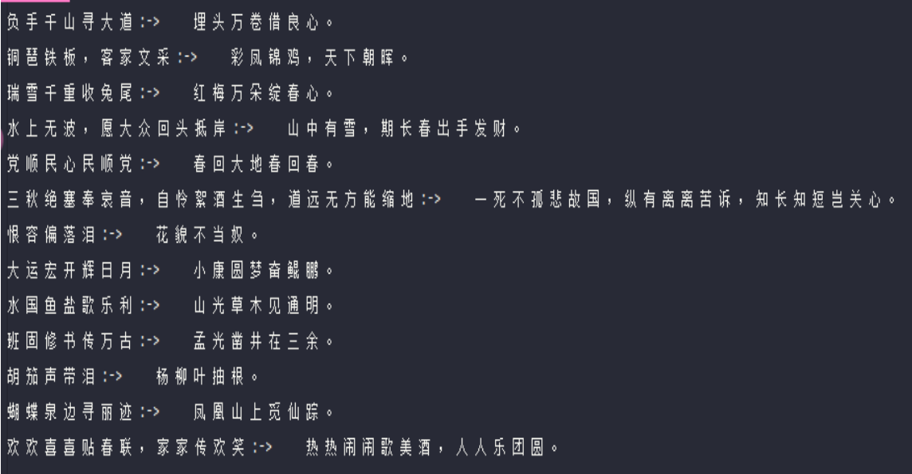

# GPTbased-Chinese-Poetry-Generator

> 很久以前做的课设，基于GPT2的诗句生成，输入诗句上文生成下文

## DATA

引用Github的对联数据集https://github.com/wb14123/couplet-dataset.git，包含七十万条对联上下文数据，下载到`couplet`文件夹。

## Train

采用预训练中文古诗GPT2模型[gpt2-chinese-poem](https://huggingface.co/uer/gpt2-chinese-poem)，运行python3 main.py

## Predic

在`couplet`的test中输入诗句上文，修改main.py后预测，效果：

